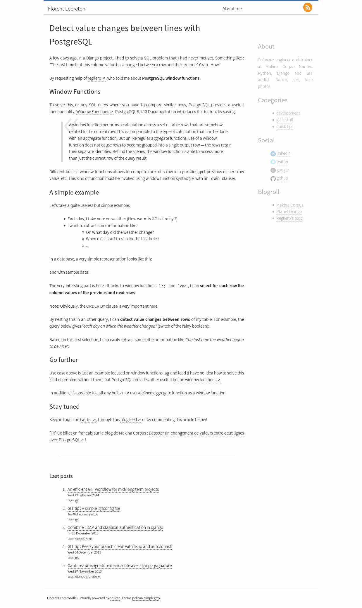
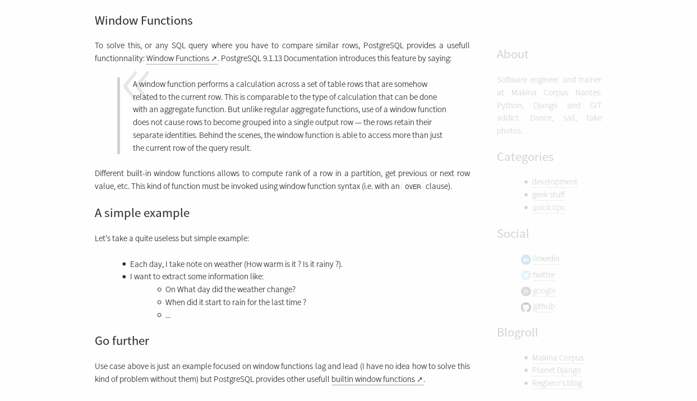

# sober #

Pelican-sober is a very light theme focused on readability :

* Integration of [TinyTypo](http://tinytypo.tetue.net)
* Utilisation of the font Source Sans Pro
* Option to fade out sidebar to focus on article reading

This theme provides classical features like Google & Piwik Analytics, Twitter, Disqus and Pygments integration.

## Screenshot ##

## Homepage options ##

* ``PELICAN_SOBER_HOME_LISTS_ARTICLES = True | False (default False) `` option allows you to either promote the last post on homepage or a paginated list of all articles

## Sidebar options ##

* ``PELICAN_SOBER_ABOUT = "My name is Brian" `` option allows you to add a short *About* block in sidebar
* ``PELICAN_SOBER_STICKY_SIDEBAR = True | False `` option allows you to set the sidebar fixed (following scroll and fading out)

## Twitter cards ##

[Twitter card metadata](https://dev.twitter.com/docs/cards/types/summary-card) are useful to provides a better overview of your post
when a tweet point to it.

If you provide one of the two settings below, twitter card metadata will be automatically added for each post.

* ``PELICAN_SOBER_TWITTER_CARD_CREATOR = '__fle__' `` (author twitter account)
* ``PELICAN_SOBER_TWITTER_CARD_SITE = '__company__' `` (website/company twitter account)

## Google Analytics ##

* ``GOOGLE_ANALYTICS = ‘UA-XXXX-YYYY'``

## Guag.es Analytics ##

* ``GUAGES = '_guages_id_'``

## PIWIK Analytics ##

* ``PIWIK_URL = 'piwik.mysite.com'`` (Base URL of your PIWIK server)
* ``PIWIK_SSL_URL = 'secure-piwik.mysite.com'`` (ONLY required if different from PIWIK_URL)
* ``PIWIK_SITE_ID = '3' `` (The site ID assigned to this website)

## Credits ##

* Icons by [Jorge Calvo](http://dribbble.com/shots/1074961-Flat-Icons-EPS), slightly adapted by [Ingrid Hamard](http://ingrid.hamard.free.fr)
